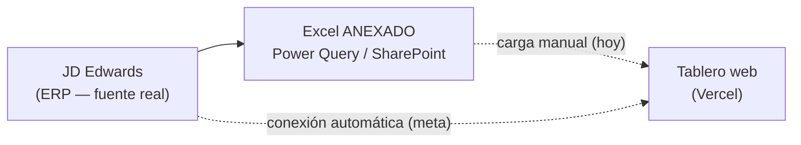
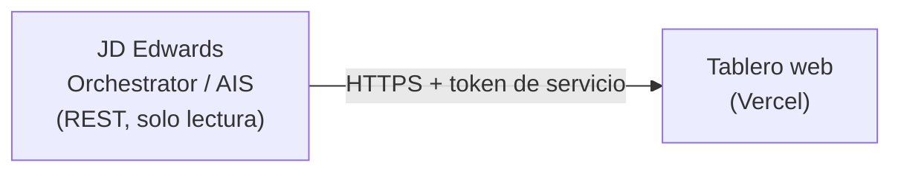
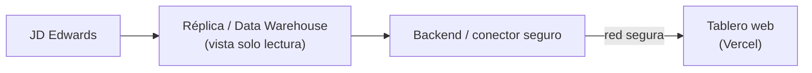
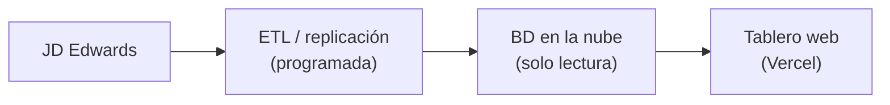
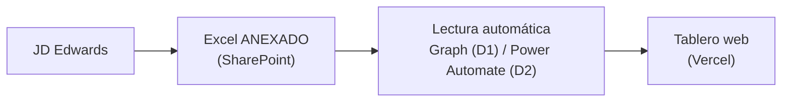

# Roadmap de conexión de datos en vivo — Tablero de Inventario MP Nacional

**Propósito de este documento:** presentar a TI las opciones técnicas para alimentar, de forma automática y segura, el tablero web de inventario de materia prima (MP) con datos provenientes del ERP corporativo **JD Edwards**, y facilitar la decisión sobre cuál aprobar.

**Audiencia:** equipo de TI / Sistemas / Seguridad de la información.

---

## 1. Contexto

- **Qué es la aplicación:** un tablero web (Next.js, alojado en Vercel) que muestra el inventario de MP por ubicación y tanque, ocupación, acidez, prioridades de despacho a refinería (DANEC SANGOLQUI) y un asistente analítico.
- **Cómo se alimenta hoy:** manualmente. Un archivo **Excel** con la hoja `ANEXADO` (consolidado con **Power Query**) se carga a mano en la app. Ese Excel reside en **SharePoint**.
- **Fuente real de los datos:** el ERP **JD Edwards**. El Excel/Power Query es solo una capa intermedia que hoy consolida y "congela" la información.
- **Meta:** eliminar la carga manual y conectar la data de forma **automática y, en lo posible, en vivo**, con la gobernanza y seguridad que TI requiera.

### Restricciones técnicas ya identificadas
- La app corre en **Vercel** (nube pública, sin servidor propio persistente). Para fuentes internas (on-premise) necesita consumir **una API** o **una base de datos accesible**, no un driver local.
- El tenant de Microsoft 365 **exige aprobación de administrador** para que cualquier aplicación lea datos (no se puede automatizar el SharePoint sin que TI apruebe un permiso, aunque sea de solo lectura).
- Por seguridad, todas las opciones se plantean como **solo lectura** y con **mínimo privilegio**.

> Nota a confirmar por TI: versión de JD Edwards en uso — **EnterpriseOne** (lo más común, con AIS/Orchestrator REST) o **World** (IBM i / DB2, integración vía base de datos o servicios). Las opciones 1 y 2 asumen EnterpriseOne; si es World, se ajustan hacia acceso de base de datos / servicios.

---

## 2. Panorama de opciones

Ordenadas de **mayor "en vivo" y gobernanza** a **menor esfuerzo de TI**.

### Vista general (situación actual y meta)

### Opción A — API REST de JD Edwards (Orchestrator / AIS)  ⭐ recomendada
Exponer el inventario mediante una **orquestación REST de solo lectura** en JD Edwards EnterpriseOne (AIS Server / Orchestrator Studio). La app consume ese endpoint con una credencial de servicio.

- **Arquitectura:**

- **Qué se le pide a TI:**
  - Habilitar/confirmar **AIS Server** y **Orchestrator** (incluidos en Tools Release 9.2).
  - Crear una **orquestación** que devuelva el inventario requerido (las columnas del `ANEXADO`).
  - Un **usuario de servicio de solo lectura** y exponer el endpoint de forma segura (allowlist de IP / gateway / API Management).
- **Seguridad:** controlada 100% por TI; solo expone lo aprobado; sin acceso a la base transaccional.
- **En vivo:** sí, datos al momento de la consulta.
- **Esfuerzo / costo:** medio para TI (crear la orquestación). **Sin costo de licencia adicional** (Orchestrator es parte de EnterpriseOne).
- **Pros:** estándar Oracle, gobernado, en vivo, desacoplado de la base. **Contras:** requiere tiempo de un técnico JDE y exponer el endpoint a la nube de forma segura.

### Opción B — Acceso de solo lectura a base de datos (réplica o vista)
TI provee una **vista de solo lectura** del inventario sobre una **réplica** de JDE (no la base transaccional) o sobre el **data warehouse de BI**, y la app la lee a través de un pequeño backend o de una base espejo en la nube.

- **Arquitectura:**

- **Qué se le pide a TI:** una vista de solo lectura con los campos del `ANEXADO`; un mecanismo seguro de acceso desde la nube (VPN/túnel, o réplica a una base en la nube).
- **Seguridad:** buena si es sobre réplica/DWH (no toca producción). Exponer base de datos a la nube exige cuidar la **red** (no recomendable abrir la BD directo a internet).
- **En vivo:** según frecuencia de la réplica (de minutos a horas).
- **Esfuerzo / costo:** medio-alto (infra de red/réplica). **Pros:** datos estructurados, reutilizable para otros reportes. **Contras:** complejidad de red/seguridad para llegar desde Vercel.

### Opción C — Pipeline ETL a una base en la nube (gobernado por TI)
Un proceso programado (job de BI existente, Data Integrator, o similar) **replica** los campos del inventario desde JDE a una **base de datos en la nube de solo lectura** (p. ej. Azure SQL o Supabase/PostgreSQL). La app lee esa base.

- **Arquitectura:**

- **Qué se le pide a TI:** definir/operar el job de replicación hacia la base en la nube designada.
- **Seguridad:** muy buena (la app nunca toca la red interna; solo una base espejo).
- **En vivo:** casi en vivo (según cadencia del job: p. ej. cada 15–60 min).
- **Esfuerzo / costo:** medio-alto (montar el pipeline); costo de infra de la base en la nube (bajo en tiers iniciales). **Pros:** desacoplado, escalable, base para más analítica. **Contras:** TI debe montar y operar el pipeline.

### Opción D — Automatizar el Excel/SharePoint actual (puente Microsoft)
Mantener el `ANEXADO` en SharePoint como fuente, pero **leerlo automáticamente** con permiso de TI, en vez de cargarlo a mano.

- **Arquitectura:**

- **Variante D1 (Microsoft Graph):** registrar una app de **solo lectura** y que TI **apruebe el consentimiento** (una sola vez). Un proceso programado descarga el Excel y actualiza el tablero.
- **Variante D2 (Power Automate):** un flujo que lee la tabla y la envía a una base/API (requiere conector HTTP **premium**).
- **Qué se le pide a TI:** aprobar el consentimiento de la app de solo lectura (D1) o habilitar la licencia de Power Automate (D2).
- **Seguridad:** solo lectura de un archivo ya existente.
- **En vivo:** **no** real — refleja el último **guardado/refresh** del Power Query.
- **Esfuerzo / costo:** **bajo** (D1: solo aprobar un permiso). **Pros:** cambio mínimo, desbloqueo rápido. **Contras:** depende del refresh manual del Excel; no es la fuente primaria.

---

## 3. Comparativa rápida

| Opción | En vivo | Esfuerzo TI | Costo extra | Gobernanza | Llega desde Vercel |
|---|---|---|---|---|---|
| **A. JDE Orchestrator REST** | ✅ Sí | Medio | Ninguno | Alta | ✅ (HTTPS) |
| **B. BD solo lectura / réplica** | ◑ Según réplica | Medio-alto | Red/infra | Alta | ⚠️ Requiere red segura |
| **C. ETL a BD en la nube** | ◑ Casi en vivo | Medio-alto | Infra baja | Muy alta | ✅ |
| **D. Excel/SharePoint auto** | ❌ No real | Bajo | Bajo/medio | Media | ✅ |

---

## 4. Recomendación por fases

1. **Quick win (desbloqueo inmediato) — Opción D1.** Aprobar el consentimiento a una app de **solo lectura** del Excel en SharePoint. Esfuerzo mínimo para TI (un clic de aprobación) y elimina la carga manual mientras se evalúa lo demás.
2. **Objetivo recomendado — Opción A (JDE Orchestrator REST).** Es la vía estándar de Oracle para integraciones modernas: en vivo, gobernada por TI, sin licencia adicional y consumible directamente desde la app. **Es la que sugerimos priorizar.**
3. **Evolución / escala — Opción C.** Si a futuro se quiere más analítica o varias apps consumiendo la data, una réplica/ETL a una base en la nube de solo lectura es la base más sólida.

---

## 5. Lo que pedimos concretamente a TI (resumen accionable)

- **Para empezar ya (D1):** aprobar el consentimiento de una aplicación de **solo lectura** sobre el archivo `ANEXADO` en SharePoint.
- **Para la meta (A):** confirmar versión de JD Edwards; habilitar/confirmar **AIS + Orchestrator**; crear una **orquestación REST de solo lectura** con los campos del `ANEXADO`; un **usuario de servicio** y exposición segura del endpoint (allowlist de IP / gateway).
- **Transversal:** todo **solo lectura**, **mínimo privilegio**, credenciales gestionadas por TI, tráfico **HTTPS**.

---

## Anexo — Glosario breve

- **JD Edwards EnterpriseOne:** ERP de Oracle usado por la empresa; fuente primaria del inventario.
- **AIS (Application Interface Services):** servidor de EnterpriseOne que expone funcionalidad vía **API REST**.
- **Orchestrator:** herramienta de EnterpriseOne para crear **orquestaciones REST** (combinando consultas de datos y servicios) sin desarrollar código a medida.
- **Power Query:** función de Excel/Power BI que consolida datos de varias fuentes; hoy arma la hoja `ANEXADO`.
- **Microsoft Graph:** API oficial de Microsoft 365 para leer datos de SharePoint/OneDrive (requiere permiso aprobado por TI).
- **Vercel:** plataforma en la nube donde está publicada la app web.
- **Solo lectura / mínimo privilegio:** principio de seguridad — la app solo puede *leer* exactamente lo necesario, nunca modificar.
